Forest Compliance Platform Flowchart
====================================

Mermaid Definition
------------------

```mermaid
flowchart TD
    A[Forest Compliance Assurance Platform] --> B[Operations Audit Services]
    A --> C[Financial Assessment Services]

    %% Operations branch
    B --> B1[Traceability Verification]
    B --> B2[Compliance Risk Assessment]
    B --> B3[Performance Monitoring]
    B --> B4[Capacity Building]

    B1 --> D1[Geo-referenced supplier mapping & documentation review]
    B1 --> D2[On-site/remote field verification]
    B2 --> D3[Multi-standard risk screening & due diligence]
    B2 --> D4[Prioritised remediation roadmap]
    B3 --> D5[Satellite & sensor alerting]
    B3 --> D6[KPI dashboards & reporting cadence]
    B4 --> D7[SOPs, training modules, knowledge transfer]
    B4 --> D8[Partner alignment for ongoing compliance]

    %% Financial branch
    C --> C1[Cost-Benefit Analysis]
    C --> C2[Supply Chain Value Assessment]
    C --> C3[Investment-Grade Reporting]
    C --> C4[Financial Risk Mitigation]

    C1 --> E1[ROI models & compliance investment planning]
    C1 --> E2[Market access vs. compliance cost scenarios]
    C2 --> E3[Supplier financial scorecards]
    C2 --> E4[Stability rankings & investment recommendations]
    C3 --> E5[Investor briefings & impact statements]
    C3 --> E6[ESG performance metrics & disclosures]
    C4 --> E7[Risk quantification models]
    C4 --> E8[Contingency plans & scenario analysis]

    %% Integrated outputs to client segments
    D1 & D3 & D5 & D7 & E1 & E3 & E5 & E7 --> F1[Forest-Risk Corporates]
    D2 & D4 & D6 & D8 & E2 & E4 & E6 & E8 --> F2[Commodity Traders & Processors]
    D1 & D5 & D7 & E3 & E5 --> F3[Banks & Institutional Investors]
    D2 & D4 & D6 & D8 & E6 --> F4[Certification Bodies & NGOs]
```

Usage Notes
-----------

- Paste the Mermaid block into any Mermaid-compatible editor (e.g., mermaid.live) to render the flow chart.
- For slideware or documentation, export the rendered chart as SVG/PNG and embed alongside the service descriptions.

